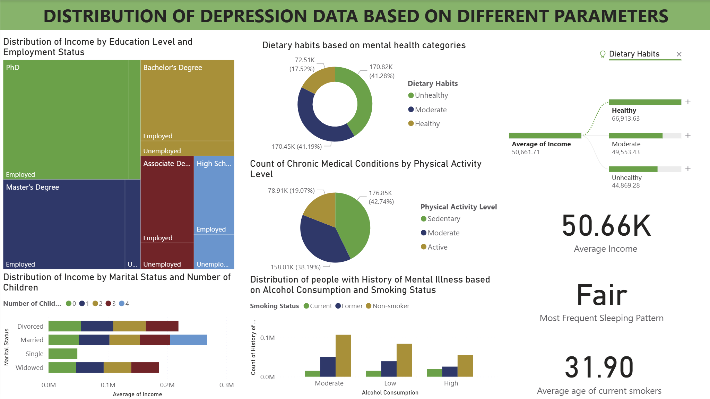

# Depression-Data-Analysis

## Introduction
This README provides a comprehensive summary of the data analysis performed on a dataset related to various factors that may contribute to depression. The dataset, named depression_data, includes a range of variables such as age, marital status, education level, lifestyle habits (e.g., smoking, physical activity, alcohol consumption), medical history, and income levels. The goal of this analysis is to uncover insights, correlations, and patterns that could help in understanding the factors influencing mental health, particularly depression, and to identify key risk factors and trends within the dataset.

## Key Analysis and Insights
Age and Income Relationship:
The average age and income are calculated for different age groups to explore the relationship between these two variables.

## Marital Status and Income:
The average income is analyzed for different marital statuses to understand how marital status might influence income levels.

## Smoking Status and Physical Activity Level:
A count of records is generated for different combinations of smoking status and physical activity levels to identify any notable patterns.

## Employment Status and Income:
The average income is analyzed across different employment statuses to understand the income distribution among employed and unemployed individuals.

## Chronic Medical Conditions:
A count of records with chronic medical conditions is generated to understand the prevalence of such conditions in the dataset.

## Physical Activity Level and Sleep Patterns:
The relationship between physical activity level and sleep patterns is explored using joins to identify any associations.

## Dietary Habits and Chronic Medical Conditions:
The relationship between dietary habits and chronic medical conditions is analyzed to see how diet may be linked to chronic health issues.

## Lifestyle Risk Factors:
A lifestyle risk factor column is added to classify individuals based on their smoking status, alcohol consumption, and physical activity levels.

## Family Health Risk:
A family health risk column is introduced, categorizing individuals based on their family history of depression and presence of chronic medical conditions.

## Age Group with Most Smokers:
The age group with the highest number of current smokers is identified.

## Mental Illness and Substance Abuse:
The total number of individuals with both a history of mental illness and substance abuse is calculated.

## Correlation Between Income and Mental Illness:
A correlation analysis is performed between income and history of mental illness, revealing a weak negative correlation, suggesting low dependence.

# Conclusion
This data analysis provides valuable insights into the factors associated with depression, highlighting key relationships and patterns that can be useful for further research and intervention strategies. The SQL queries used in this analysis demonstrate how complex data can be explored and understood through relational database techniques.
